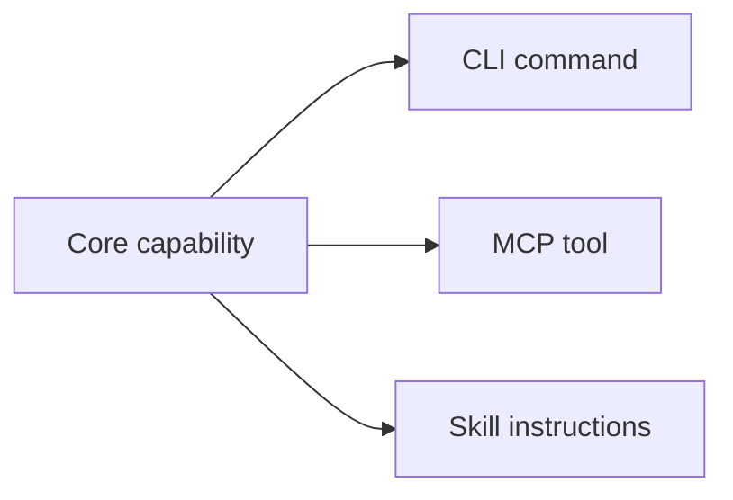
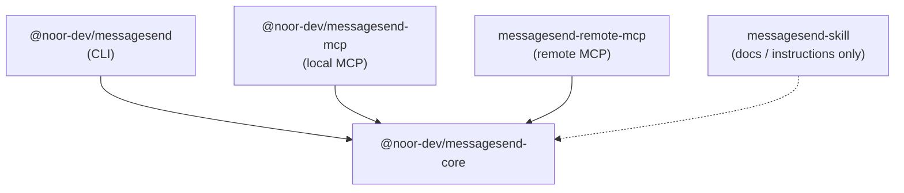

<p align="center">
  
</p>

<h1 align="center">MessageSend</h1>

<p align="center">
  Build agent-ready tools with one shared TypeScript core for MCP, CLI, and Skills.
</p>

<p align="center">
  by <a href="https://x.com/noorabdullah">@noorabdullah</a>
</p>

<p align="center">
  <a href="./LICENSE"></a>
  <a href="https://www.npmjs.com/package/@noor-dev/messagesend"></a>
  <a href="https://github.com/NoorAbdullah02/MessageSend"></a>
  <a href="https://cwa.run/railway"></a>
  <a href="https://cwa.run/clerk"></a>
</p>

> **Prompt:** "Send Noor a Telegram message saying the build shipped."
>
> **Agent:** Uses MessageSend's `telegram` MCP tool with `{ "chatId": "...", "message": "The build shipped." }`, backed by the same core operation available from the CLI and Skill.

## Quick Start

```bash
npm install -g @noor-dev/messagesend
messagesend init --telegram-bot-token "<bot-token>"
messagesend telegram "<chat-id>" "Hello from MessageSend"
```

<details>
<summary><strong>Table of contents</strong></summary>

- [Video Tutorial](#video-tutorial)
- [What Is MessageSend?](#what-is-messagesend)
- [Who This README Is For](#who-this-readme-is-for)
- [What Is Included](#what-is-included)
- [Prerequisites](#prerequisites)
- [Use MessageSend](#use-messagesend)
- [Fork Or Adapt MessageSend](#fork-or-adapt-messagesend)
- [Run Locally](#run-locally)
- [Architecture Details](#architecture-details)
- [Telegram Operation](#telegram-operation)
- [Publish Packages To NPM](#publish-packages-to-npm)
- [Troubleshooting](#troubleshooting)

</details>

## Video Tutorial

This repository is built from scratch, step by step, in a 4-hour tutorial:

**[The Only Guide You Need to Build Claude Skills and MCP Servers ▶](https://www.youtube.com/watch?v=YKIUt9ytxIE)**

It walks through the entire `core → CLI → MCP → Skill` pattern, including the local and remote MCP adapters and Clerk-protected remote deployment.

## What Is MessageSend?

MessageSend is both a tutorial and a boilerplate for modern agent tooling. It shows how one shared operation can become a complete agent-facing toolkit: a CLI command, a local MCP tool, a remote MCP server, and Skill instructions.

The example operation sends Telegram messages, but the structure is intentionally easy to replace. Swap the operation in `packages/core`, update the adapters, and you have a strong starting point for a different product, internal tool, workflow automation, or agent capability.

The central pattern is:



Business logic lives in `packages/core`. Every other package is an adapter, so agents, scripts, and humans all use the same implementation instead of drifting copies.

## Who This README Is For

Start with the section that matches your goal:

- [Use MessageSend](#use-messagesend): Install the published CLI, local MCP server, and Skill.
- [Fork Or Adapt MessageSend](#fork-or-adapt-messagesend): Turn the boilerplate into your own agent tooling project.
- [Run Locally](#run-locally): Develop the tutorial or modify the packages from source.
- [Publish Packages To NPM](#publish-packages-to-npm): Release notes for maintainers.

## What Is Included

| Package              | Role                                           |
| -------------------- | ---------------------------------------------- |
| `packages/core`      | Shared Zod schemas and operation logic.        |
| `packages/cli`       | Human/script CLI adapter (Commander-based).    |
| `packages/local-mcp` | Local MCP stdio server adapter for AI clients. |
| `apps/remote-mcp`    | Remote MCP HTTP adapter (Hono + Clerk OAuth).  |
| `skills/messagesend` | Agent-facing usage instructions (SKILL.md).    |

## Prerequisites

- A Telegram bot token (get one from [@BotFather](https://t.me/BotFather)).
- **Node.js 22+** for published package usage.
- **Bun** if you want to run or adapt this repository locally.
- A Node-compatible MCP client to connect the local MCP server (e.g., Claude desktop, OpenCode).

## Use MessageSend

Use this path when you want the published MessageSend tools, not the source workspace.

### CLI

Install the CLI globally:

```bash
npm install -g @noor-dev/messagesend
```

Configure your Telegram bot token:

```bash
messagesend init --telegram-bot-token "<bot-token>"
```

Send a message (output is always JSON):

```bash
messagesend telegram "<chat-id>" "Hello from MessageSend"
```

Expected JSON output:

```json
{
  "ok": true,
  "chatId": "<chat-id>",
  "messageId": 123
}
```

The CLI config file is stored at `~/.config/messagesend/config.json` with restricted permissions (`0o600`).

You can also set the `TELEGRAM_BOT_TOKEN` environment variable to bypass the config file.

### Local MCP

Install the local MCP stdio server globally:

```bash
npm install -g @noor-dev/messagesend-mcp
```

Configure your MCP client to run `messagesend-mcp` and pass `TELEGRAM_BOT_TOKEN` through the server environment:

```json
{
  "mcpServers": {
    "messagesend": {
      "command": "messagesend-mcp",
      "args": [],
      "environment": {
        "TELEGRAM_BOT_TOKEN": "<bot-token>"
      }
    }
  }
}
```

If your MCP client can execute npm packages directly, skip the global install:

```json
{
  "mcpServers": {
    "messagesend": {
      "command": "npx",
      "args": ["-y", "@noor-dev/messagesend-mcp"],
      "environment": {
        "TELEGRAM_BOT_TOKEN": "<bot-token>"
      }
    }
  }
}
```

The MCP server registers one tool:

- **`telegram`** — accepts `{ chatId: string, message: string }`, returns `{ ok, chatId, messageId }`.

Do **not** include the Telegram bot token in MCP tool arguments. The local MCP server reads the token from the `TELEGRAM_BOT_TOKEN` environment variable only.

### Skill

Install the MessageSend Skill with your skill manager:

```bash
npx skills add https://github.com/NoorAbdullah02/MessageSend/tree/main/skills/messagesend
```

The Skill tells agents when to use the MCP `telegram` tool, when to fall back to the CLI, and why `@noor-dev/messagesend-core` is only an implementation detail.

CLI fallback example from the Skill:

```bash
messagesend init --telegram-bot-token "<bot-token>"
messagesend telegram "<chat-id>" "Hello from MessageSend"
```

### Remote MCP

This repository includes a remote MCP HTTP server, but MessageSend does not provide a hosted public endpoint.

For remote MCP usage, deploy your own copy of `apps/remote-mcp`. The server exposes:

- `POST /:botToken/mcp` — The main MCP endpoint. `botToken` is the URL-encoded Telegram bot token.
- `GET /.well-known/oauth-protected-resource/:botToken/mcp` — Clerk OAuth protected resource metadata.

The remote MCP app can be protected with **Clerk OAuth** while keeping the Telegram bot token in the MCP URL:

```text
https://your-messagesend-host.example.com/<telegram-bot-token>/mcp
```

**Treat this URL like a secret.** The URL contains the Telegram bot token. If it is exposed, revoke and rotate the token with BotFather.

Set Clerk environment variables before starting the remote MCP app:

```bash
CLERK_PUBLISHABLE_KEY="<publishable-key>" \
CLERK_SECRET_KEY="<secret-key>" \
bun run dev:remote-mcp
```

For MCP OAuth clients, unauthenticated requests receive `401 Unauthorized` with `WWW-Authenticate` metadata. The MCP client is responsible for opening the Clerk login flow.

In the Clerk Dashboard, enable **Dynamic client registration** for OAuth applications before testing with MCP clients that require automatic OAuth client registration.

**Claude web** connects out of the box: it performs OAuth Dynamic Client Registration automatically, so no manual OAuth client setup is needed.

**ChatGPT** connectors and custom apps do **not** support Dynamic Client Registration. You must create your own OAuth client in the Clerk Dashboard, then:

- Copy ChatGPT's redirect/callback URI and add it to the allowed redirect URIs on your Clerk OAuth client.
- Provide the resulting **client ID** and **client secret** to ChatGPT when configuring the connector.

ChatGPT connector configuration:

```text
Name: MessageSend
Description: Send Telegram messages through MessageSend MCP.
MCP Server URL: https://your-messagesend-host.example.com/<telegram-bot-token>/mcp
Authentication: OAuth
```

Example OpenCode remote MCP config after you deploy your own server:

```json
{
  "$schema": "https://opencode.ai/config.json",
  "mcp": {
    "messagesend": {
      "type": "remote",
      "url": "https://your-host.example.com/{env:TELEGRAM_BOT_TOKEN}/mcp",
      "enabled": true
    }
  }
}
```

This keeps Telegram bot tokens user-specific and client-provided without exposing them as MCP tool arguments.

## Fork Or Adapt MessageSend

Use this path when MessageSend is a starting point for something else. The Telegram operation is deliberately small so you can replace it with your own API wrapper, internal workflow, SaaS integration, developer tool, or automation.

### What To Keep

Keep the dependency direction:

```text
packages/core        → shared schemas and operations
packages/cli         → command-line adapter backed by core
packages/local-mcp   → local MCP stdio adapter backed by core
apps/remote-mcp      → remote MCP HTTP adapter backed by core
skills/messagesend   → agent-facing instructions and fallback guidance
```

Keep business logic in `packages/core`. Adapters should only parse inputs, read credentials from the right place, call core, and format results.

```text
CLI command = parse input + call core + print JSON output
MCP tool    = validate input + call core + return structured result
Remote MCP  = read request auth + validate input + call core
Skill       = instructions for when/how to use CLI or MCP
```

### What To Replace

Most forks replace these MessageSend-specific pieces:

- Package names in `package.json` files.
- Binary names such as `messagesend` and `messagesend-mcp`.
- The Telegram operation in `packages/core/src/schemas.ts` and `packages/core/src/operations.ts`.
- CLI commands in `packages/cli/src/index.ts`.
- MCP tool registrations in `packages/local-mcp/src/index.ts` and `apps/remote-mcp/src/index.ts`.
- Skill metadata and instructions in `skills/messagesend/SKILL.md`.
- README install, configuration, and verification commands.

### Add A New Operation

Follow the explicit registration flow:

1. Add input and output schemas in `packages/core/src/schemas.ts`.
2. Add the operation function in `packages/core/src/operations.ts`.
3. Export it through `packages/core/src/index.ts`.
4. Add a CLI command in `packages/cli/src/index.ts`.
5. Add a local MCP tool in `packages/local-mcp/src/index.ts`.
6. Add a remote MCP tool in `apps/remote-mcp/src/index.ts` when remote support is part of your project.
7. Add usage notes in your Skill `SKILL.md`.
8. Add manual verification commands to the README.

MessageSend intentionally keeps registration explicit. Do not introduce a shared operation registry until the adapter boundaries are clear.

### Credential Pattern

MessageSend uses three credential paths because each interface has a different audience:

- **CLI** reads a persisted local user config created by `messagesend init`, or falls back to `TELEGRAM_BOT_TOKEN` environment variable.
- **Local MCP** reads `TELEGRAM_BOT_TOKEN` from the environment variables provided by the MCP client.
- **Remote MCP** reads the per-request Telegram bot token from the MCP URL path (`/:botToken/mcp`).

For your own project, keep credentials out of MCP tool input schemas unless the credential is genuinely part of the operation payload.

## Run Locally

Use this path when you are following the tutorial, maintaining the repo, or changing packages before publishing.

Install workspace dependencies:

```bash
bun install
```

Run the CLI from source:

```bash
bun run dev:cli init --telegram-bot-token "<bot-token>"
bun run dev:cli telegram "<chat-id>" "Hello from MessageSend"
```

Start the local MCP stdio server from source:

```bash
TELEGRAM_BOT_TOKEN="<bot-token>" bun run dev:local-mcp
```

The process stays open and waits for MCP messages over stdio. Stop it with `Ctrl-C` when testing manually.

Example MCP client config pointing to the local source:

```json
{
  "mcpServers": {
    "messagesend": {
      "command": "bun",
      "args": ["run", "packages/local-mcp/src/index.ts"],
      "environment": {
        "TELEGRAM_BOT_TOKEN": "<bot-token>"
      }
    }
  }
}
```

Start the remote MCP HTTP server from source:

```bash
CLERK_PUBLISHABLE_KEY="<publishable-key>" \
CLERK_SECRET_KEY="<secret-key>" \
bun run dev:remote-mcp
```

The server listens on `PORT` (default `3000`), exposes public protected resource metadata at `GET /.well-known/oauth-protected-resource/:botToken/mcp`, and protects `POST /:botToken/mcp` with Clerk OAuth.

### Local Linked Binary

Use `bun link` to test the CLI as a real `messagesend` command before publishing:

```bash
cd packages/cli
bun link
messagesend --help
```

After linking, these can be run from anywhere on the machine:

```bash
messagesend init --telegram-bot-token "<bot-token>"
messagesend telegram "<chat-id>" "Hello from MessageSend"
```

To remove the local linked binary:

```bash
cd packages/cli
bun unlink
```

### Verification Commands

Run these before reporting implementation work complete:

```bash
bun install
bun run format
bun run lint
bun run typecheck

bun run dev:cli init --telegram-bot-token "<bot-token>"
bun run dev:cli telegram "<chat-id>" "Hello from MessageSend"

TELEGRAM_BOT_TOKEN="<bot-token>" bun run dev:local-mcp
CLERK_PUBLISHABLE_KEY="<publishable-key>" CLERK_SECRET_KEY="<secret-key>" bun run dev:remote-mcp
```

Manual remote verification should confirm:

- The server fails clearly without Clerk env vars (`CLERK_PUBLISHABLE_KEY`, `CLERK_SECRET_KEY`).
- The metadata route (`GET /.well-known/oauth-protected-resource/:botToken/mcp`) returns Clerk protected resource metadata.
- Missing or invalid `Authorization` header returns `401` with `WWW-Authenticate`.
- Valid Clerk OAuth reaches MCP initialization.
- The remote `telegram` MCP tool calls `@noor-dev/messagesend-core` without exposing `botToken` in the tool input schema.

## Architecture Details

Dependency direction:



**`packages/core`** owns reusable logic:

- Zod schemas for shared inputs and outputs.
- Operation functions such as `sendTelegramMessage`.
- Type exports derived from schemas.
- No CLI imports, MCP SDK imports, terminal output, prompts, or `process.exit`.

**`packages/cli`** owns human and script usage:

- Defines `messagesend telegram <chatId> <message>` via Commander.
- Reads credentials from local config file or `TELEGRAM_BOT_TOKEN` env var.
- Calls `@noor-dev/messagesend-core` functions.
- Prints JSON output to stdout.

**`packages/local-mcp`** owns local MCP stdio usage:

- Creates an MCP stdio server using `@modelcontextprotocol/sdk`.
- Registers a `telegram` tool backed by `@noor-dev/messagesend-core`.
- Reads the bot token from `TELEGRAM_BOT_TOKEN` environment variable.
- Returns both `content` (text) and `structuredContent` (object).

**`apps/remote-mcp`** owns remote MCP HTTP usage:

- Creates a Hono HTTP app exposing `/:botToken/mcp`, run by Bun.
- Protects the endpoint with Clerk OAuth authentication.
- Reads the Telegram bot token from the URL path per request.
- Keeps the token out of the MCP tool input schema.
- Creates a per-request MCP server and closes it after handling the request.
- Uses `@clerk/mcp-tools` for protected resource metadata generation.

**`skills/messagesend`** owns agent instructions (SKILL.md):

- Prefers the MCP `telegram` tool when available.
- Documents CLI fallback usage.
- Explains that `@noor-dev/messagesend-core` is an implementation detail.
- Avoids duplicating business logic.

## Telegram Operation

MessageSend includes one canonical tutorial operation: `sendTelegramMessage`.

Public interface names:

```text
core function: sendTelegramMessage
CLI command:   messagesend telegram <chatId> <message>
MCP tool:      telegram
Skill usage:   telegram
```

The operation sends a message through the [Telegram Bot API](https://core.telegram.org/bots/api#sendmessage):

- **CLI**: reads the bot token from `~/.config/messagesend/config.json` (created by `messagesend init`) or `TELEGRAM_BOT_TOKEN` env var.
- **Local MCP**: reads `TELEGRAM_BOT_TOKEN` from the MCP client-provided server environment.
- **Remote MCP**: reads the token from the per-request MCP URL path (`/:botToken/mcp`).

All adapters pass the token into `@noor-dev/messagesend-core`; it is not exposed as an MCP tool argument.

### Schema

The core package exports Zod schemas for validation:

```typescript
// Input (agent-facing, no bot token)
telegramMessageInputSchema = { chatId: string, message: string }

// Full options (internal, includes bot token)
telegramMessageOptionsSchema = { chatId: string, message: string, botToken: string }

// Telegram API request body
telegramSendMessageRequestSchema = { chat_id: string, text: string }

// Telegram API response
telegramSendMessageResponseSchema = { ok: boolean, result?: { message_id: number }, description?: string }

// Output
telegramMessageOutputSchema = { ok: true, chatId: string, messageId: number }
```

## Publish Packages To NPM

This section is for MessageSend maintainers and fork authors publishing adapted packages. Normal users can skip it.

Three packages are published to npm:

| Package                          | Path               |
| -------------------------------- | ------------------ |
| `@noor-dev/messagesend-core`     | `packages/core`    |
| `@noor-dev/messagesend`          | `packages/cli`     |
| `@noor-dev/messagesend-mcp`      | `packages/local-mcp` |

Publish order matters: **core first**, then CLI and local MCP (which depend on core).

### Version Bumps

Before publishing, bump versions in `package.json`. If core changed, bump `packages/core/package.json` first:

```json
{
  "name": "@noor-dev/messagesend-core",
  "version": "0.1.4"
}
```

Leave the CLI and local MCP dependency on core as `workspace:*`. `bun publish` resolves `workspace:*` to the bumped core version at publish time, so you never hand-edit dependency ranges.

If the CLI changed, bump `packages/cli/package.json`.
If the local MCP server changed, bump `packages/local-mcp/package.json`.

After editing versions, refresh the lockfile from the repository root:

```bash
bun install
```

### Pre-Publish Checks

Run the full workspace checks before publishing any package:

```bash
bun run format:check
bun run lint
bun run typecheck
bun run build:core
bun run build:cli
bun run build:local-mcp
```

Package builds run through `tsdown`, which produces native Node ESM output in `dist/`:

```text
dist/index.js
dist/index.d.ts
dist/index.js.map
```

### Git Commit Timing

Commit release preparation changes before running `bun publish`. The commit should include version bumps, lockfile updates, and documentation changes. Publishing from a committed state makes the npm package traceable to a specific repository revision.

After the publish succeeds, verify npm metadata and consider creating a git tag for the published version. If publishing fails before the package is accepted by npm, fix the issue, rerun the checks, and commit the fix before trying again. If npm accepts the publish but a later verification step fails, do not reuse the same version; bump to a new version for the next publish because npm versions are immutable.

### Publish Core

```bash
cd packages/core
bun publish --dry-run
bun publish
```

`bun publish` runs the `prepublishOnly` build and reads `publishConfig.access` from `package.json`.

If npm asks for a one-time password:

```bash
bun publish --otp <code>
```

If npm says you are not logged in:

```bash
npm login
```

After publishing, verify:

```bash
npm view @noor-dev/messagesend-core version
```

### Publish CLI

Publish the CLI only after the matching `@noor-dev/messagesend-core` version is already on npm.

```bash
cd packages/cli
bun publish --dry-run
bun publish
```

After publishing, verify:

```bash
npm view @noor-dev/messagesend version
npm install -g @noor-dev/messagesend
messagesend --help
messagesend telegram "<chat-id>" "Hello from MessageSend"
npm uninstall -g @noor-dev/messagesend
```

### Publish Local MCP

Publish the local MCP package only after the matching `@noor-dev/messagesend-core` version is already on npm.

```bash
cd packages/local-mcp
bun publish --dry-run
bun publish
```

After publishing, verify:

```bash
npm view @noor-dev/messagesend-mcp version
npm install -g @noor-dev/messagesend-mcp
command -v messagesend-mcp
npm uninstall -g @noor-dev/messagesend-mcp
```

To manually verify runtime startup, run `TELEGRAM_BOT_TOKEN="<bot-token>" messagesend-mcp` and stop the stdio server with `Ctrl-C`.

## Troubleshooting

| Problem | Solution |
| ------- | -------- |
| `bun --filter` cannot find a package | Run `bun install` from the repository root and confirm the package name matches the workspace package name. |
| TypeScript cannot resolve workspace packages | Confirm each package has `"type": "module"`, an `exports` entry, and a dependency that can resolve locally. |
| MCP server appears to hang | That is expected for stdio mode. It waits for MCP client messages until the process is stopped. |
| MCP client cannot start the server | Confirm the command is available on `PATH`, use `npx -y @noor-dev/messagesend-mcp`, or use an absolute path in local development config. |
| CLI output is difficult to parse in scripts | The CLI always outputs JSON to stdout — parse it directly. |
| Telegram requests fail from the CLI | Run `messagesend init` and confirm the bot can send messages to the target chat. Check that the bot token is valid. |
| Telegram requests fail from MCP | Confirm the MCP client config provides `TELEGRAM_BOT_TOKEN` in the server `environment`. |
| Remote MCP returns 401 | Ensure Clerk OAuth is set up correctly and the client is passing a valid Bearer token. |
| Remote MCP fails to start | Ensure both `CLERK_PUBLISHABLE_KEY` and `CLERK_SECRET_KEY` environment variables are set. |
